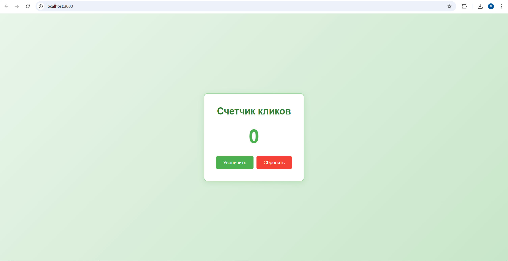
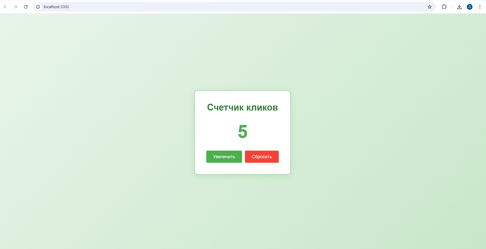
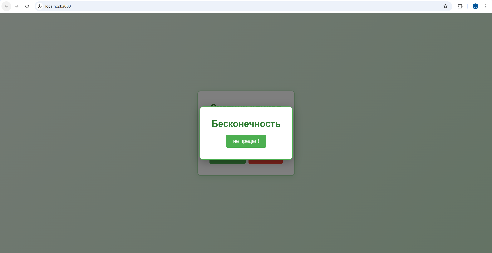

# Счетчик кликов на Express.js

Простое веб-приложение для подсчета кликов, построенное на Express.js.

## Требования

- Node.js
- npm

## Установка

1. Клонируйте репозиторий:
```bash
git clone <url-репозитория>
cd Click_counter
```

2. Установите зависимости:
```bash
npm install
```

## Запуск приложения

```bash
npm start
```

Приложение будет доступно по адресу: `http://localhost:3000`

## Структура проекта

```
Click_counter/
├── controllers/
│   └── clickController.js    # Контроллер для работы со счетчиком
├── routes/
│   └── clickRoutes.js         # Маршруты API
├── middleware/
│   └── logger.js              # Middleware для логирования
├── public/
│   ├── index.html             # Главная страница
│   ├── style.css              # Стили
│   └── app.js                 # Клиентский JavaScript
├── server.js                  # Главный файл сервера
└── package.json               # Зависимости проекта
```

## Функционал

-  Базовый Express-сервер
-  Маршруты (GET, POST, PUT, DELETE)
-  Работа с параметрами (req.params)
-  Работа с query-параметрами (req.query)
-  Обработка тела запроса (express.json, express.urlencoded)
-  Собственный middleware для логирования
-  Раздача статических файлов (express.static)
-  Модульная структура (routes + controllers)

## Скриншоты

### Главная страница


### Работа счетчика


### Пасхалка на 99 клике


## Автор

Петушкова Дарья ЭФБО-04-24